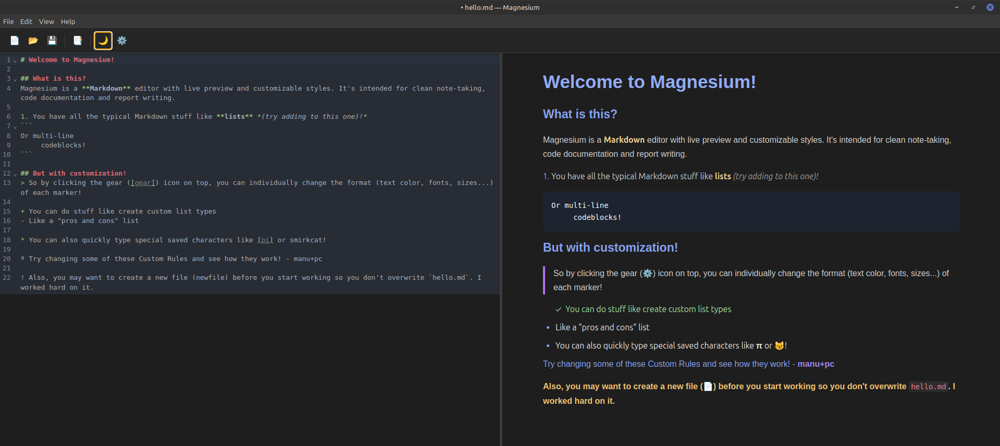

# Magnesium

Editor de Markdown con vista previa instantánea e personalización de estilos, para Linux.

[English version / Versión en inglés](README.md)



---

## Funcionalidades

- **Vista previa en directo** — editor e Markdown renderizado en paralelo, actualizado mentres escribes
- **Estilos personalizables** — controla tipos de letra, tamaños, cores, espazado e fondos para cada elemento Markdown
- **Presets de estilo** — presets integrados (Default, GitHub, Dracula, Solarized Light); garda, carga, importa e exporta os teus propios
- **Regras de formato personalizadas** — define substitucións de caracteres, estilos de prefixo de liña, resaltados por expresión regular e formatado de marcadores de lista
- **Modo escuro** — entorno de edición escuro puramente estético; as exportacións sempre se xeran en modo claro
- **Exportación a PDF** — exporta o documento actual como PDF con estilo
- **Marcadores de lista estendidos** — soporte para `>`, `~`, `:`, `!`, `?`, `#`, `@`, `$`, `%`, `&`, `=`, `^`, `|`, `\` como marcadores non ordenados, e `ordered:.`, `ordered:)`, `ordered:alpha` para listas ordenadas
- **Resaltado de sintaxe** — bloques de código resaltados con highlight.js e temas GitHub e GitHub Dark
- **Internacionalización** — interface en inglés e galego, seleccionable nos axustes
- **Atallos de teclado** — `Ctrl+N`, `Ctrl+O`, `Ctrl+S`, `Ctrl+Shift+S`, `Ctrl+,`, `Ctrl+Shift+E`, `Ctrl+Shift+D`

---

## Construído con

- [Electron](https://www.electronjs.org/)
- [TypeScript](https://www.typescriptlang.org/)
- [CodeMirror 6](https://codemirror.net/)
- [unified](https://unifiedjs.com/) / [remark](https://remark.js.org/) / [rehype](https://rehype.js.org/)

---

## Primeiros pasos

### Requisitos previos

- [Node.js](https://nodejs.org/) 18 ou posterior
- npm

### Instalar dependencias

```bash
npm install
```

### Executar en modo desenvolvemento

```bash
npm run dev
```

### Compilar para produción

```bash
npm run build
```

### Empaquetar como distribuíble

```bash
npm run dist
```

Obxectivos Linux: AppImage e .deb (configurado en `package.json` baixo `"build"`).

---

## Atallos de teclado

| Acción | Atallo |
|---|---|
| Ficheiro novo | `Ctrl+N` |
| Abrir ficheiro | `Ctrl+O` |
| Gardar | `Ctrl+S` |
| Gardar como | `Ctrl+Shift+S` |
| Exportar PDF | `Ctrl+Shift+E` |
| Activar/desactivar modo escuro | `Ctrl+Shift+D` |
| Axustes | `Ctrl+,` |

---

## Regras de formato personalizadas

As regras defínense no panel de Axustes, baixo **Regras personalizadas**.

| Tipo | Descrición |
|---|---|
| `char-replace` | Substitúe unha cadea literal por outra (ex.: `(c)` → `©`). Opcións de ámbito: fóra do código, só en liña, todo. |
| `line-prefix` | Aplica un estilo aos parágrafos que comecen cun prefixo determinado. |
| `inline-regex` | Aplica un estilo ao texto que coincida cunha expresión regular JavaScript. |
| `list-marker` | Aplica un estilo (e un símbolo de marcador opcional) aos elementos de lista que usen un carácter de marcador específico. |

---

## Licenza

[MIT](LICENSE)
